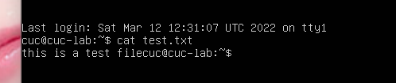
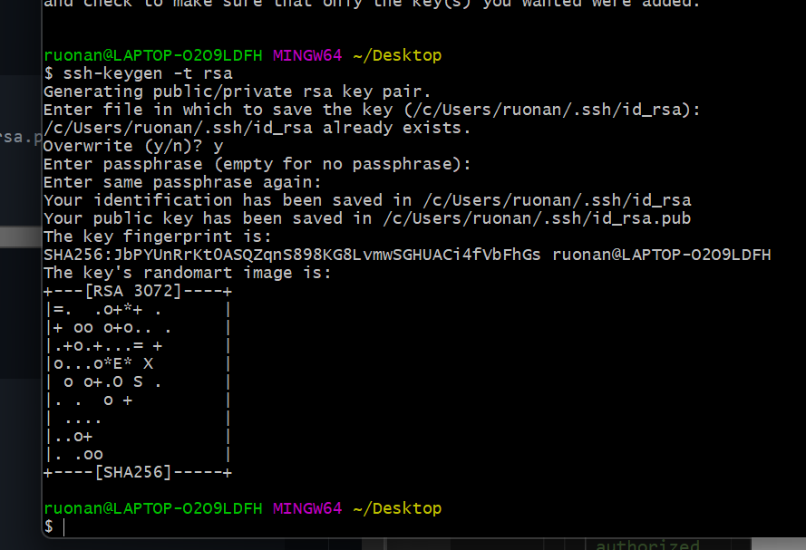

实验报告（一） ——Linux基础实验
======================


软件环境
---------------------

 - *Virtualbox 6.1*
 - *ubuntu 20.04.02 Server 64bit*
 - *阿里云 云起实验室 提供的【零门槛云上实践平台】*

**********************

实验问题
---------------------

  ### 一、调查并记录实验环境的如下信息：
  #### 1.当前Linux发行版基本信息
   
  - **操作过程：**  

      ```shell
       操作代码：lsb_release -a
      ```

  - lsb_release命令用来查看当前系统的发行版信息，包括发行版名称、版本号及代号等。  
    - *可得出当前虚拟机Linux的发行版信息为Ubuntu 20.04*  
       
     

    - *可得出当前阿里云远程Linux的发行版信息为CentOS 7.7.1908*  
       


  #### 2.当前Linux内核版本信息

  - __操作过程：__  

  - uname是一个打印系统信息的工具，包括内核名称、版本号、系统详细信息及所运行的操作系统等。 

      ```shell
       操作代码：uname -a 
      ``` 
    - *可得出当前虚拟机Linux的内核版本信息为：5.4.0-104-generic*  
       
     

    - *可得出当前阿里云远程Linux的内核版本信息为：kernel-3.10.0-1062*  
       


   
  ### 二、Virtualbox 安装完 Ubuntu 之后新添加的网卡如何实现系统开机自动启用和自动获取 IP？
   - __操作过程：__ 

     - ①查询当前所有网卡信息。

      ```shell
       操作代码：ip a 
      ``` 
       

      - ②修改配置文件并应用。
      ```shell
       操作代码：
       sudo vim /etc/netplan/00-installer-config.yaml
       sudo netplan apply
      ``` 
       

      - ③再次查询网卡状态并获取IP。


  ### 三、如何使用 `scp` 在「虚拟机和宿主机之间」、「本机和远程 Linux 系统之间」传输文件？

  - ` scp ` (secure copy) 命令是Linux系统下基于ssh登录进行安全的远程文件拷贝。  

  #### 1.使用`scp`在「虚拟机和宿主机之间」传输文件
   - __操作过程：__ 

      
      `scp`命令的基本语法：
      ```shell
      scp [options] [[user@]host1:]file1 … [[user@]host2:]file2
      ```
      - Windows宿主机到Linux虚拟机
      ```shell
      操作代码：scp C:\Users\ruonan\Desktop\test.txt cuc@192.168.56.101:~/
      ```
      使用`scp`语句将宿主机与虚拟机相连，输入yes以及密码，将测试文件`test.txt`拷贝到虚拟机上。

      
        
     


  #### 2.使用 `scp` 在「本机和远程 Linux 系统之间」传输文件：
   - __操作过程：__  
    
     - ①登录阿里云平台，利用[Linux指令入门-文件与权限的云服务场景](https://developer.aliyun.com/adc/scenario/exp/a12055b0e9e84e5692b05ae25d377ec0)作为远程Linux系统。
     - ②分别查看远程Linux的弹性IP、发行版和内核版本。
      ```shell
       操作代码：ip a （查看弹性IP）
                lsb_release -a （查看发行版本信息）
                uname -a （查看内核版本信息）
      ```

       


     - ③同上，使用`scp`语句将本机与远程Linux相连，输入yes以及密码，将测试文件`test.txt`拷贝到阿里云Linux系统上。
     ```shell
     操作代码：scp C:/Users/ruonan/Desktop/test.txt root@101.133.129.23:remote_folder
     ```

     


  ### 四、如何配置 SSH 免密登录？

  - __操作过程：__ 

     - ①打开gitbash，输入
     ```shell
     操作代码：
     ssh-keygen -t rsa 
     #提示输入东西时，连续按3次回车即可，在~/.ssh目录下生成了id_rsa和id_rsa.pub两个文件，后者上传至目标服务器。
     ssh-copy-id server_user@ipAddr
     #server_user是Ubuntu服务器用户名，ipAddr是对应地址。
     ```
     
     


     - ②在Linux虚拟机上进行输入
     ```shell
     操作代码：
     vim /etc/ssh/sshd_config
     #找到/etc/ssh/sshd_config这个文件，取消以下几行注释。
     #RSAAuthentication yes
     #PubkeyAuthentication yes
     #AuthorizedKeysFile .ssh/authorized_keys
     退出vim：:q!

     sudo service ssh restart
     #重启服务
     ```
     
     


     - ③在Linux中查看公钥内容
     ```shell
     操作代码：cat ~/.ssh/authorized_keys
     ```
     

     - ④在cmd中输入
     ```shell
     操作代码：ssh username@remote
     ```
     即可免密登录虚拟机的Linux系统。
     

     - ⑤在cmd中通过修改配置来实现别名登录
     ```shell
     操作代码：
     #1.进入.ssh文件夹
     C:\Users\username>cd .ssh
     #2.输入cd .>config，在.ssh中创建host配置文件config
     C:\Users\usernamen\.ssh>cd .>config
     #3.输入Host自定义名称（建议用服务器名）
     C:\Users\username\.ssh>echo Host cuc >> config
     #4.输入HostName 服务器ip地址
    C:\Users\username\.ssh>echo HostName 192.168.56.101 >> config
     #5.输入User 服务器名
    C:\Users\username\.ssh>echo User cuc >> config
     #6.输入Port 22
    C:\Users\username\.ssh>echo Port 22 >> config
    #通过 type config可查看你修改后的配置信息
     C:\Users\username\.ssh>type config
     ```
     

     即可使用`ssh 服务器名`直接免密登录虚拟机的Linux系统。
     

     


*********************
遇到的问题与解决方案
--------------------
- **不知道如何使用和编写Markdown。**
*上网查询了Markdown的相关教程。*  

- **未充分理解Linux的发行版本和内核版本的概念以及不知如何去查询。**
*回看了老师有关发行版和内核版本内容的录播视频，并且上网查找阅读了相关的文章。*

- **不了解`scp`语句的具体用法，导致文件传输无法实现。**
*查询相关文件，学习了`scp`的用法。*  

- **在配置ssh免密登陆时，在虚拟机上进行了操作**
*询问同学后，找到了gitbash，在gitbash上进行了操作。* 

- **Git提交作业创建分支的问题**
*查看老师的录播视频，与同学讨论。* 
********************


参考文献/资料引用
----------------------
- [Markdown使用教程](https://www.runoob.com/markdown/md-tutorial.html)
- [查看Linux发行版名称和版本号的8种方法](https://linux.cn/article-9586-1.html)
- [使用`scp`命令在Linux操作系统之间传递文件](https://blog.csdn.net/weixin_30765319/article/details/99558452)
- [使用`scp`命令在Linux和Windows之间传递文件](https://blog.csdn.net/weixin_30765319/article/details/99558452)
- [Windows+gitbash实现免密登录Ubuntu](https://blog.csdn.net/qq_42123832/article/details/113712378)
- [Windows中使用ssh连接Linux服务器以及设置免密登录和配置别名](https://blog.csdn.net/weixin_42633385/article/details/88785250)
- [Ubuntu20添加新网卡后设置自动启用并获取IP](https://blog.csdn.net/xiongyangg/article/details/110206220)
- [使用Git提交作业到GitHub相关问题讨论](https://www.yuque.com/c4pr1c3/linux/xx2ca1)