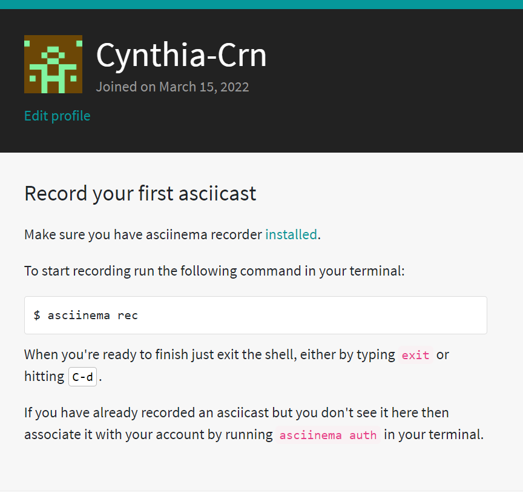
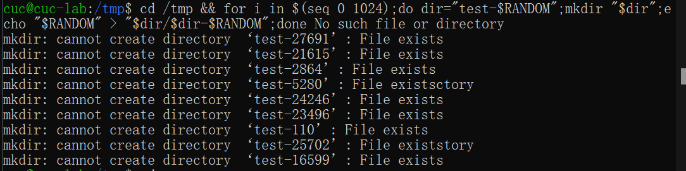
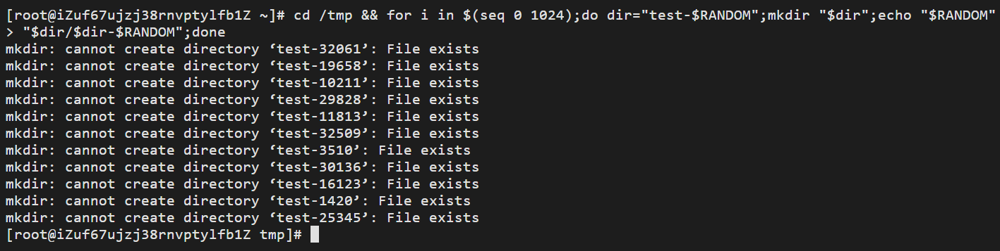
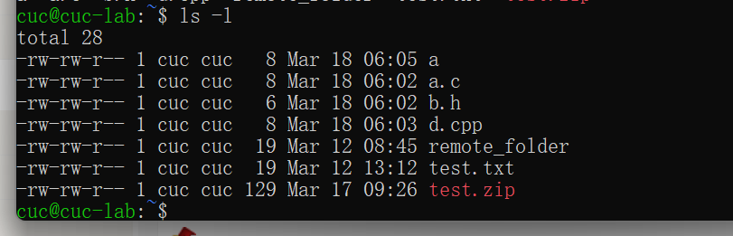

# Linux第二章实验

-------------------------------------

## 软件坏境  

- **当前课程推荐的 Linux 发行版本**

- **本地环境（Ubuntu）** 

- **云环境（CentOS）**  

- **在[asciinema](https://asciinema.org/)注册一个账号，并在本地安装配置好asciinem** 

- **确保本地已经完成asciinema auth，并在asciinema成功关联了本地账号和在线账号**  


 

------------------------

## 实验问题

- **一、使用表格方式记录至少 2 个不同 Linux 发行版本上以下信息的获取方法，使用 [asciinema](https://asciinema.org/) 录屏方式「分段」记录相关信息的获取过程和结果** 

- **二、【软件包管理】在目标发行版上安装 `tmux` 和 `tshark` ；查看这 2 个软件被安装到哪些路径；卸载 `tshark` ；验证 `tshark` 卸载结果**  

- **三、【文件管理】复制以下**
```shell
cd /tmp && for i in $(seq 0 1024);do dir="test-$RANDOM";mkdir "$dir";echo "$RANDOM" > "$dir/$dir-$RANDOM";done
```
 **代码到终端运行，在目标 Linux 发行版系统中构造测试数据集，然后回答以下问题：**
  
  - **找到 `/tmp` 目录及其所有子目录下，文件名包含 `666` 的所有文件**
  - **找到 `/tmp` 目录及其所有子目录下，文件内容包含 `666` 的所有文件**

- **四、【文件压缩与解压缩】练习课件中 [文件压缩与解压缩](https://c4pr1c3.github.io/LinuxSysAdmin/chap0x02.md.html#/12/1) 一节所有提到的压缩与解压缩命令的使用方法**

- **五、【跟练】 [子进程管理实验](https://asciinema.org/a/f3ux5ogwbxwo2q0wxxd0hmn54)**

- **六、【硬件信息获取】目标系统的 CPU、内存大小、硬盘数量与硬盘容量**

--------------------------------

## 本地安装与配置asciinema及其使用方法

**Installation：**

- Ubuntu版本
```shell
sudo apt-add-repository ppa:zanchey/asciinema
sudo apt-get update
sudo apt-get install asciinema
```

- 其他版本的安装方法可以到 [asciinema官网](https://asciinema.org/)查看，有详尽说明。

**Usage：**
- To start recording run the following command in your terminal:
```shell
asciinema rec
```
- When you're ready to finish just exit the shell, either by typing `exit`or hitting `Ctrl-d`.



-----------------------------------


### 一、【软件包管理】在目标发行版上安装 `tmux` 和 `tshark` ；查看这 2 个软件被安装到哪些路径；卸载 `tshark` ；验证 `tshark` 卸载结果  


###### 本地环境（Ubuntu20.04）

- 安装 `tmux`
```shell
操作代码：sudo apt install tmux
```
[](https://asciinema.org/a/0R1tV89wQeRW6mcrvuLAlKniv)


- 查看 `tmux`安装路径
```shell
操作代码：sudo apt-cache show tmux
```
[](https://asciinema.org/a/KpqVOR6KJ5yATqY5ZsrPBL3di)


- 安装 `tshark`
```shell
操作代码：sudo apt install tshark
```
[](https://asciinema.org/a/BP5n3KcHxmv0Rh6uU7ylm7pbG)


- 查看 `tshark`安装路径
```shell
操作代码：sudo apt-cache show tshark
```
[](https://asciinema.org/a/4e4MR8XN7wundo1UORwwwy9mq)


- 卸载 `tshark`
```shell
操作代码：
sudo apt-get remove tshark (删除软件包而保留软件的配置文件)
sudo apt-get purge tshark (同时清除软件包和软件的配置文件)
```
[](https://asciinema.org/a/mswVOUV9tTidfLPY8FhJjzKml)


###### 云环境（CentOS7.7）

- 安装 `tmux`
```shell
操作代码：yum install tmux
```
[](https://asciinema.org/a/CCs0nPRMYn3MAu8kRShX6QzXV)


- 查看 `tmux`安装路径
```shell
操作代码：rpm -qal | grep tmux
```
[](https://asciinema.org/a/zHmXnSHJRQ8WKhgyf6aLia15I)


- 安装 `tshark`
```shell
操作代码：yum install wireshark(在CentOS中，tshark包含在wireshark中，因此只需安装wireshark。)
```
[](https://asciinema.org/a/8IPKlpqMBNkJ9w36pDRm9bx96)


- 查看 `tshark`安装路径
```shell
操作代码：rpm -qal | grep wireshark
```
[](https://asciinema.org/a/eZPJjt6R0tDJJfXe70XmYsWSX)


- 卸载 `tshark`
```shell
操作代码：
yum -y remove wireshark
```
[](https://asciinema.org/a/9nBCSv8VNA7xkLqkkie0cMopf)


### 二、【文件管理】复制以下代码

```shell
cd /tmp && for i in $(seq 0 1024);do dir="test-$RANDOM";mkdir "$dir";echo "$RANDOM" > "$dir/$dir-$RANDOM";done
```

### 到终端运行，在目标 Linux 发行版系统中构造测试数据集，然后回答以下问题：
  
  - **找到 `/tmp` 目录及其所有子目录下，文件名包含 `666` 的所有文件**
  - **找到 `/tmp` 目录及其所有子目录下，文件内容包含 `666` 的所有文件**

###### 本地环境（Ubuntu20.04）


- **找到 `/tmp` 目录及其所有子目录下，文件名包含 `666` 的所有文件**
```shell
操作代码：sudo find ./ -type f -name "*666*"
```
[](https://asciinema.org/a/ajI6CXva30n6DAcplMHLvoU9z)


- **找到 `/tmp` 目录及其所有子目录下，文件内容包含 `666` 的所有文件**
```shell
操作代码：sudo grep -r "666" ./ --exclude=*.cast
（利用"--exclude"解决因asciinema录制时会在当前目录中写入后缀为".cast"文件而产生乱码的问题）
```
[](https://asciinema.org/a/zckrr9MLslShTDkKsNKNc77KS)


###### 云环境（CentOS7.7）


- **找到 `/tmp` 目录及其所有子目录下，文件名包含 `666` 的所有文件**
```shell
操作代码：sudo find ./ -type f -name "*666*"
```
[](https://asciinema.org/a/bSD7zRzdWosJrZw3ONNNbeKlT)


- **找到 `/tmp` 目录及其所有子目录下，文件内容包含 `666` 的所有文件**
```shell
操作代码：sudo grep -r "666" ./ --exclude=*.cast
```
[](https://asciinema.org/a/gQtiFd9n9r8vnILsTLh6GZ9wH)


### 三、【文件压缩与解压缩】练习课件中 [文件压缩与解压缩](https://c4pr1c3.github.io/LinuxSysAdmin/chap0x02.md.html#/12/1) 一节所有提到的压缩与解压缩命令的使用方法

- 在主机上创建`a.c`,`b.h`,`d.cpp`等文件并且copy到Linux虚拟机上。
```shell
操作代码：
cuc@虚拟机IP地址:~/ (拷贝到虚拟机上)
ls -l (查看是否上传成功)
```


- **gzip**
    - 文件压缩
    ```shell
    操作代码：gzip 文件 
    ```

    - 文件解压
    ```shell
    操作代码：gzip -dv 文件 
    ```
    [](https://asciinema.org/a/sw9xE5uAp0skGeVyHVf8G7BZT)


- **bzip2**
    - 文件压缩
    ```shell
    操作代码：bzip2 文件 
    ```

    - 文件解压
    ```shell
    操作代码：bzip2 -d 文件 
    ```
    [](https://asciinema.org/a/h9Ki95c6qg3MwvjUPzk7RIE5Z)


- **zip**
    - 文件压缩
    ```shell
    操作代码：zip -r 文件.zip 文件
    ```

    - 文件解压
    ```shell
    操作代码：unzip 文件.zip 
    ```
    [](https://asciinema.org/a/wJvGPdyGdq3Gd4sorSusbMVFV)


- **tar**
    - 文件压缩
    ```shell
    操作代码：tar -czvf test1.tar.gz b.h  (压缩 b.h文件为test1.tar.gz)
    ```

    - 文件解压
    ```shell
    操作代码：tar -xzvf test1.tar.gz 
    ```
    [](https://asciinema.org/a/XeeJ3RCKUddnTiK2dJ6KlsuYp)


- **7z (p7zip)**
    - 文件压缩
    ```shell
    操作代码：p7zip 文件
    ```

    - 文件解压
    ```shell
    操作代码：7z x 文件.7z
    ```
    [](https://asciinema.org/a/Y4gfpHHQvccuwmmBFUt6XkBXa)


- **rar (p7zip-rar / unrar-free)**
    - 文件压缩
    ```shell
    操作代码：rar a 文件.rar 文件
    ```

    - 文件解压
    ```shell
    操作代码：
    rar x 文件.rar 
    unrar e 文件.rar
    ```
    [](https://asciinema.org/a/iNwXzLMjuzxZFIXFAPFj6I4sr)


### 四、【跟练】 [子进程管理实验](https://asciinema.org/a/f3ux5ogwbxwo2q0wxxd0hmn54)

[](https://asciinema.org/a/uXbRQYDk0AoqTEsyHEE81EMog)


### 五、【硬件信息获取】目标系统的 CPU、内存大小、硬盘数量与硬盘容量

###### 本地环境（Ubuntu20.04）

- CPU
```shell
操作代码：
grep "model name" /proc/cpuinfo |awk -F ':' '{print $NF}'
(查看CPU型号)
cat /proc/cpuinfo | grep "physical id" | uniq | wc -l
(查看CPU个数)
cat /proc/cpuinfo | grep "cpu cores" | uniq 
(查看CPU核数)
```

- 内存
```shell 
操作代码：cat /proc/meminfo | grep MemTotal
```

- 硬盘
```shell
操作代码：sudo fdisk -l | grep Disk 
```
[](https://asciinema.org/a/3oF0yqIYgUZ0whTt0VKpnGTRI)

###### 云环境（CentOS7.7）

- CPU
```shell
操作代码：
cat /proc/cpuinfo | grep 'model name' |uniq 
(查看CPU型号)
cat /proc/cpuinfo | grep "physical id" | uniq | wc -l
(查看CPU个数)
cat /proc/cpuinfo | grep "cpu cores" | uniq 
(查看CPU核数)
```


- 内存
```shell 
操作代码：cat /proc/meminfo | grep MemTotal
```


- 硬盘
```shell
操作代码：
df -hl 
(查看磁盘剩余空间)
df -h 
(展示文件系统信息)
```

[](https://asciinema.org/a/477945)


### 结果表格

|  Linux发行版本   | Ubuntu 20.04 |  CentOS 7.7  |
|  :----:  | :----:  | :---:  |
| **安装软件包**  | `apt install` | `yum install -y` |
| **更新软件包**  | `apt upgrade` | `yum update` |
| **卸载软件包**  | `apt remove` | `yum remove` |
| **查看软件包安装路径**  | `apt show` | `yum search` |
| **查看文件名**  | `sudo find ./ -type f -name "*&&&*"` | `find ./ -name '*&&&*'` | 
| **查看文件内容**  | `sudo grep -r "***" ./ --exclude = *.cast` | `sudo grep -r '666' ./ --exclude=*.cast` |
| **文件解压缩**`gzip`  | `gzip 文件`\ `gzip -dv 文件 ` | 同左 |
| **文件解压缩**`bzip2`  | `bzip2 文件`\ `bzip2 -d 文件 ` | 同左 |
| **文件解压缩**`zip`  | `zip -r 文件.zip 文件`\ `unzip 文件.zip ` | 同左 |
| **文件解压缩**`tar`  | `tar -czvf test1.tar.gz b.h  (压缩 b.h文件为test1.tar.gz)`\ `tar -xzvf test1.tar.gz` | 同左 |
| **文件解压缩**`7z(p7zip)`  | `p7zip 文件`\ `7z x 文件.7z` | 同左 |
| **文件解压缩**`rar`  | `rar a 文件.rar 文件`\ `unrar e 文件.rar` | 同左 |
| **硬件信息获取（CPU）**  | `grep "model name" /proc/cpuinfo | awk -F ':' '{print $NF}'(查看CPU型号)`,`cat /proc/cpuinfo | grep "physical id" | uniq | wc -l(查看CPU个数)`,`cat /proc/cpuinfo | grep "cpu cores" | uniq (查看CPU核数)` | `cat /proc/cpuinfo | grep 'model name' | uniq (查看CPU型号)`,`cat /proc/cpuinfo | grep "physical id" | uniq | wc -l(查看CPU个数)`,`cat /proc/cpuinfo | grep "cpu cores" | uniq  (查看CPU核数)` |
| **硬件信息获取（内存）**  | `cat /proc/meminfo | grep MemTotal` | `cat /proc/meminfo | grep MemTotal` |
| **硬件信息获取（硬盘）**     | `sudo fdisk -l | grep Disk` | `df -h` |


## 问题及解决方法
- **在Ubuntu中的`/tmp`目录及其所有子目录下查找文件内容包含`666`的所有文件,但是执行之后出现了乱码，不知道是什么原因，如何可以解决呢？**  
 答：利用`--exclude`解决因asciinema录制时会在当前目录中写入后缀为`.cast`文件而产生乱码的问题.     

- **在`ping`百度时，没有接收，丢包率100%，为什么会这样，之前还可以的。**
 答：可以改为`ping baidu.com` ，应该是www.baidu.com做了cname解析到 www.a.shifen.com，但是它解析到的ip不能用了，可以用dig www.baidu.com看解析过程。

- **【硬件信息获取】命令的用法并不清楚，而且发行版不同，其中的命令语法也存在差异。**
 答：通过上网查询相关的命令用法和老师的录播视频，深刻学习了语句的正确用法。

- **在CentOS发行版本上安装tshark时，发现没有这个软件包。**  
 答：因为CentOS发行版本上的tshark包含于wireshark软件包中，下载wireshark软件包即可。

- **在进行 【文件解压缩】 部分实验时，不知道命令的解压缩语法。**
 答：通过上网查询相关的命令用法的文章，但是版本上有些出入，按照系统指令更新了一些操作。

- **实验二的作业已经交到GitHub上了，但是asciinema视频 我在GitHub上打不开是为什么，具体情况是实验报告中有略缩图，能点击跳转到另一个网页，但是却不能够播放，打开的不是asciinema网站。附上我的`视频链接代码` 和 `结果`截图。**
 答：果然就是附链接的写法错了，asciinema的视频make public之后，点击share,有直接给出的markdown路径，可以复制，例如：`[](https://asciinema.org/a/477945)`。

-------------------------------------


## 参考文献/资料引用
- [asciinema_installation](https://asciinema.org/docs/installation)

- [ubuntu安装和查看已安装](https://www.cnblogs.com/forward/archive/2012/01/10/2318483.html)

- [Ubuntu20.04如何卸载软件](https://blog.csdn.net/weixin_43994864/article/details/110531264)

- [linux下rar包的解压方法](https://blog.csdn.net/yonggeit/article/details/72190246)

- [Linux zip命令](https://www.runoob.com/linux/linux-comm-zip.html)

- [因asciinema录制时会在当前目录中写入后缀为`.cast`文件而产生乱码的问题](http://courses.cuc.edu.cn/course/82669/forum#/topics/224452?show_sidebar=false&scrollTo=topic-224452&pageIndex=3&pageCount=3&topicIds=225676,224452,224041,223642,223333,220990,219985,219877&predicate=lastUpdatedDate&reverse)

- [ping百度时失败了的问题](http://courses.cuc.edu.cn/course/82669/forum#/topics/236836?show_sidebar=false&scrollTo=topic-236836&pageIndex=1&pageCount=4&topicIds=237646,237037,236836,236686,235699,235129,232900,232747,232663,232636&predicate=lastUpdatedDate&reverse)

- [linux中查看CPU型号,内存大小,硬盘空间的命令](https://www.cnblogs.com/chong-zuo3322/p/14133802.html)
