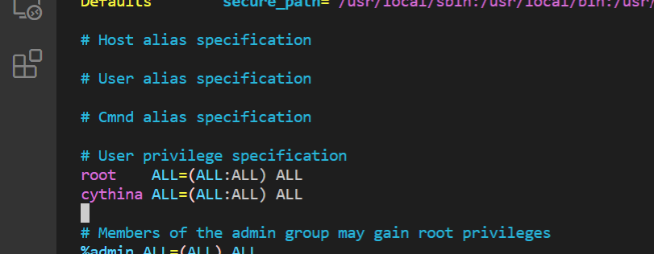
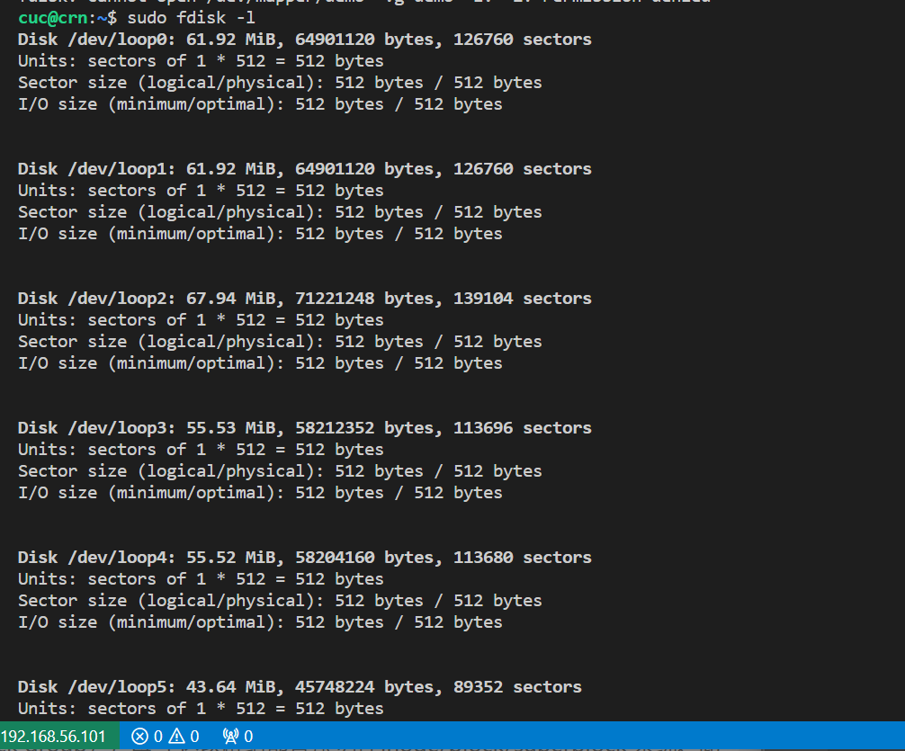

# Linux第三章实验

-------------------------------------

## 软件坏境  

- **VirtualBox 6.1**

- **Ubuntu 20.04** 
 
- **完整实验操作过程通过[asciinema](https://asciinema.org/)进行录像并上传** 

 

------------------------

## 实验问题

 ### 一、根据[Systemd 入门教程：命令篇 by 阮一峰的网络日志](http://www.ruanyifeng.com/blog/2016/03/systemd-tutorial-commands.html)完成相关Systemd基本操作

 ### 二、根据[Systemd 入门教程：实战篇 by 阮一峰的网络日志](http://www.ruanyifeng.com/blog/2016/03/systemd-tutorial-commands.html)完成相关Systemd基本操作

 ### 三、自查清单：
  - **如何添加一个用户并使其具备sudo执行程序的权限？**

  - **如何将一个用户添加到一个用户组？**

  - **如何查看当前系统的分区表和文件系统详细信息？**

  - **如何实现开机自动挂载Virtualbox的共享目录分区？**

  - **基于LVM（逻辑分卷管理）的分区如何实现动态扩容和缩减容量？**

  - **如何通过systemd设置实现在网络连通时运行一个指定脚本，在网络断开时运行另一个脚本？**

  - **如何通过systemd设置实现一个脚本在任何情况下被杀死之后会立即重新启动？实现杀不死？**


  -----------------------------------


### 一、根据[Systemd 入门教程：命令篇 by 阮一峰的网络日志](http://www.ruanyifeng.com/blog/2016/03/systemd-tutorial-commands.html)完成相关Systemd基本操作 

#### 1.启动服务
```shell
$ sudo /etc/init.d/apache2 start
# 或者
$ service apache2 start
```
[](https://asciinema.org/a/jSQPMlFdVLBTiXteFMmrFkYel)


#### 2.查看Systemd版本
```shell
$ systemctl --version
```
[](https://asciinema.org/a/IlCAwrGudXfM2F6lOzNvIFd1k)


#### 3.系统管理

**3.1 systemctl**
```shell
# 重启系统
$ sudo systemctl reboot

# 关闭系统，切断电源
$ sudo systemctl poweroff

# CPU停止工作
$ sudo systemctl halt

# 暂停系统
$ sudo systemctl suspend

# 让系统进入冬眠状态
$ sudo systemctl hibernate

# 让系统进入交互式休眠状态
$ sudo systemctl hybrid-sleep

# 启动进入救援状态（单用户状态）
$ sudo systemctl rescue
```
- 除`sudo systemctl rescue`，其他情况执行后都会关机。

- 执行`sudo systemctl rescue`后，`Ctrl+D`后再次输入用户名和口令来登陆系统。


**3.2 systemd-analyze**
```shell
# 查看启动耗时
$ systemd-analyze           

# 查看每个服务的启动耗时
$ systemd-analyze blame

# 显示瀑布状的启动过程流
$ systemd-analyze critical-chain

# 显示指定服务的启动流
$ systemd-analyze critical-chain atd.service
```
[](https://asciinema.org/a/isD1WgutBnK6YyCAwsuesvWaB)


**3.3 hostnamectl**
```shell
# 显示当前主机的信息
$ hostnamectl

# 设置主机名。
$ sudo hostnamectl set-hostname rhel7
```
[](https://asciinema.org/a/6dJ4IX8wZSQdZcq5vQLf4jMKu)


**3.4 localectl**
```shell
# 查看本地化设置
$ localectl

# 设置本地化参数。
$ sudo localectl set-locale LANG=en_GB.utf8
$ sudo localectl set-keymap en_GB
```
[](https://asciinema.org/a/irGQPeo8rBYDTCGNQY3tGhez5)


**3.5 timedatectl**
```shell
# 查看当前时区设置
$ timedatectl

# 显示所有可用的时区
$ timedatectl list-timezones                  

# 设置当前时区
$ sudo timedatectl set-timezone America/New_York
$ sudo timedatectl set-time YYYY-MM-DD
$ sudo timedatectl set-time HH:MM:SS
```
[](https://asciinema.org/a/lL9DTftjLqyNk3bxklOHtG6ZW)


**3.6 loginctl**
```shell
# 列出当前session
$ loginctl list-sessions

# 列出当前登录用户
$ loginctl list-users

# 列出显示指定用户的信息
$ loginctl show-user ruanyf
```
[](https://asciinema.org/a/GE0lIP8k0H9iAm7M5I9lu1ctv)


#### 4.Unit

**4.1 systemctl list-units**
```shell
# 列出正在运行的 Unit
$ systemctl list-units

# 列出所有Unit，包括没有找到配置文件的或者启动失败的
$ systemctl list-units --all

# 列出所有没有运行的 Unit
$ systemctl list-units --all --state=inactive

# 列出所有加载失败的 Unit
$ systemctl list-units --failed

# 列出所有正在运行的、类型为 service 的 Unit
$ systemctl list-units --type=service
```
[](https://asciinema.org/a/THL85OgcQ4YEQYRqXtQs5SyXD)


**4.2 Unit 的状态**
- `systemctl status`命令用于查看系统状态和单个 Unit 的状态。
```shell
# 显示系统状态
$ systemctl status

# 显示单个 Unit 的状态
$ systemctl status bluetooth.service

# 显示远程主机的某个 Unit 的状态
$ systemctl -H root@rhel7.example.com status httpd.service
```

- 除了`status`命令，`systemctl`还提供了三个查询状态的简单方法，主要供脚本内部的判断语句使用。
```shell
# 显示某个 Unit 是否正在运行
$ systemctl is-active application.service

# 显示某个 Unit 是否处于启动失败状态
$ systemctl is-failed application.service

# 显示某个 Unit 服务是否建立了启动链接
$ systemctl is-enabled application.service
```
[](https://asciinema.org/a/pSxNUxFWcsuQC3406fmR59XBx)


**4.3 Unit 管理**
```shell
# 立即启动一个服务
$ sudo systemctl start apache.service

# 立即停止一个服务
$ sudo systemctl stop apache.service

# 重启一个服务
$ sudo systemctl restart apache.service

# 杀死一个服务的所有子进程
$ sudo systemctl kill apache.service

# 重新加载一个服务的配置文件
$ sudo systemctl reload apache.service

# 重载所有修改过的配置文件
$ sudo systemctl daemon-reload

# 显示某个 Unit 的所有底层参数
$ systemctl show httpd.service

# 显示某个 Unit 的指定属性的值
$ systemctl show -p CPUShares httpd.service

# 设置某个 Unit 的指定属性
$ sudo systemctl set-property httpd.service CPUShares=500
```
[](https://asciinema.org/a/6U39T07aQkYVWUH9DwEqOMI9n)


**4.4 依赖关系**
Unit 之间存在依赖关系：A 依赖于 B，就意味着 Systemd 在启动 A 的时候，同时会去启动 B。

- `systemctl list-dependencies`命令列出一个 Unit 的所有依赖。
```shell
$ systemctl list-dependencies nginx.service
```

- 上面命令的输出结果之中，有些依赖是 Target 类型（详见下文），默认不会展开显示。如果要展开 Target，就需要使用`--all`参数。
```shell
# 查看本地化设置
$ systemctl list-dependencies --all nginx.service
```
[](https://asciinema.org/a/YSQpw3ibKFlH1LR14YhBIiOp2)


#### 5.Unit 的配置文件

**5.1 概述**
每一个 Unit 都有一个配置文件，告诉 Systemd 怎么启动这个 Unit 。

Systemd 默认从目录`/etc/systemd/system/`读取配置文件。但是，里面存放的大部分文件都是符号链接，指向目录`/usr/lib/systemd/system/`，真正的配置文件存放在那个目录。

- `systemctl enable`命令用于在上面两个目录之间，建立符号链接关系。
```shell
$ sudo systemctl enable clamd@scan.service
# 等同于
$ sudo ln -s '/usr/lib/systemd/system/clamd@scan.service' '/etc/systemd/system/multi-user.target.wants/clamd@scan.service'
```
如果配置文件里面设置了开机启动，`systemctl enable`命令相当于激活开机启动。

- 与之对应的，`systemctl disable`命令用于在两个目录之间，撤销符号链接关系，相当于撤销开机启动。
```shell
$ sudo systemctl disable clamd@scan.service
```
配置文件的后缀名，就是该 Unit 的种类，比如`sshd.socket`。如果省略，Systemd 默认后缀名为`.service`，所以`sshd`会被理解成`sshd.service`。
[](https://asciinema.org/a/HxD6YBORm4EjcQLJl0DQ6QVju)


**5.2 配置文件的状态**
- `systemctl list-unit-files`命令用于列出所有配置文件。
```shell
# 列出所有配置文件
$ systemctl list-unit-files

# 列出指定类型的配置文件
$ systemctl list-unit-files --type=service
```
这个命令会输出一个列表。
```shell
$ systemctl list-unit-files

UNIT FILE              STATE
chronyd.service        enabled
clamd@.service         static
clamd@scan.service     disabled
```
这个列表显示每个配置文件的状态，一共有四种。

   - `enabled`：已建立启动链接
   - `disabled`：没建立启动链接
   - `static`：该配置文件没有`Install`部分（无法执行），只能作为其他配置文件的依赖
   - `masked`：该配置文件被禁止建立启动链接

注意，从配置文件的状态无法看出，该 Unit 是否正在运行。这必须执行前面提到的`systemctl status`命令。
```shell
$ systemctl status bluetooth.service
```
一旦修改配置文件，就要让 SystemD 重新加载配置文件，然后重新启动，否则修改不会生效。
```shell
$ sudo systemctl daemon-reload
$ sudo systemctl restart httpd.service
```
[](https://asciinema.org/a/h1ZkO97OmlZjsIDVpOmPN0ZP9)


**5.3 配置文件的格式**
- `systemctl cat`命令可以查看配置文件的内容。
```shell
$ systemctl cat atd.service

[Unit]
Description=ATD daemon

[Service]
Type=forking
ExecStart=/usr/bin/atd

[Install]
WantedBy=multi-user.target
```
从上面的输出可以看到，配置文件分成几个区块。每个区块的第一行，是用方括号表示的区别名，比如`[Unit]`。注意，配置文件的区块名和字段名，都是大小写敏感的。
每个区块内部是一些等号连接的键值对。
```shell
[Section]
Directive1=value
Directive2=value

. . .
```
注意，键值对的等号两侧不能有空格。
[](https://asciinema.org/a/czXup82Okysgs1PHzWYliVh6s)


**5.4 配置文件的区块**
`[Unit]`区块通常是配置文件的第一个区块，用来定义 Unit 的元数据，以及配置与其他 Unit 的关系。它的主要字段如下。
  -  `Description`：简短描述
  -  `Documentation`：文档地址
  -  `Requires`：当前 Unit 依赖的其他 Unit，如果它们没有运行，当前 Unit 会启动失败
  -  `Wants`：与当前 Unit 配合的其他 Unit，如果它们没有运行，当前 Unit 不会启动失败
  -  `BindsTo`：与Requires类似，它指定的 Unit 如果退出，会导致当前 Unit 停止运行
  -  `Before`：如果该字段指定的 Unit 也要启动，那么必须在当前 Unit 之后启动
  -  `After`：如果该字段指定的 Unit 也要启动，那么必须在当前 Unit 之前启动
  -  `Conflicts`：这里指定的 Unit 不能与当前 Unit 同时运行
  -  `Condition...`：当前 Unit 运行必须满足的条件，否则不会运行
  -  `Assert...`：当前 Unit 运行必须满足的条件，否则会报启动失败

`[Install]`通常是配置文件的最后一个区块，用来定义如何启动，以及是否开机启动。它的主要字段如下。

  -  `WantedBy`：它的值是一个或多个 Target，当前 Unit 激活时（enable）符号链接会放入/etc/systemd/system目录下面以 Target 名 + .wants后缀构成的子目录中
  -  `RequiredBy`：它的值是一个或多个 Target，当前 Unit 激活时，符号链接会放入/etc/systemd/system目录下面以 Target 名 + .required后缀构成的子目录中
  -  `Alias`：当前 Unit 可用于启动的别名
  -  `Also`：当前 Unit 激活（enable）时，会被同时激活的其他 Unit

`[Service]`区块用来 Service 的配置，只有 Service 类型的 Unit 才有这个区块。它的主要字段如下。

  -  `Type`：定义启动时的进程行为。它有以下几种值。
  -  `Type=simple`：默认值，执行ExecStart指定的命令，启动主进程
  -  `Type=forking`：以 fork 方式从父进程创建子进程，创建后父进程会立即退出
  -  `Type=oneshot`：一次性进程，Systemd 会等当前服务退出，再继续往下执行
  -  `Type=dbus`：当前服务通过D-Bus启动
  -  `Type=notify`：当前服务启动完毕，会通知Systemd，再继续往下执行
  -  `Type=idle`：若有其他任务执行完毕，当前服务才会运行
  -  `ExecStart`：启动当前服务的命令
  -  `ExecStartPre`：启动当前服务之前执行的命令
  -  `ExecStartPost`：启动当前服务之后执行的命令
  -  `ExecReload`：重启当前服务时执行的命令
  -  `ExecStop`：停止当前服务时执行的命令
  -  `ExecStopPost`：停止当其服务之后执行的命令
  -  `RestartSec`：自动重启当前服务间隔的秒数
  -  `Restart`：定义何种情况 Systemd 会自动重启当前服务，可能的值包括always（总是重启）、on-success、on-failure、on-abnormal、on-abort、on-watchdog
  -  `TimeoutSec`：定义 Systemd 停止当前服务之前等待的秒数
  -  `Environment`：指定环境变量

Unit 配置文件的完整字段清单，请参考[官方文档](https://www.freedesktop.org/software/systemd/man/systemd.unit.html)。


#### 6.Target
启动计算机的时候，需要启动大量的 Unit。如果每一次启动，都要一一写明本次启动需要哪些 Unit，显然非常不方便。Systemd 的解决方案就是 Target。

简单说，Target 就是一个 Unit 组，包含许多相关的 Unit 。启动某个 Target 的时候，Systemd 就会启动里面所有的 Unit。从这个意义上说，Target 这个概念类似于"状态点"，启动某个 Target 就好比启动到某种状态。

传统的`init`启动模式里面，有 RunLevel 的概念，跟 Target 的作用很类似。不同的是，RunLevel 是互斥的，不可能多个 RunLevel 同时启动，但是多个 Target 可以同时启动。
```shell
# 查看当前系统的所有 Target
$ systemctl list-unit-files --type=target

# 查看一个 Target 包含的所有 Unit
$ systemctl list-dependencies multi-user.target

# 查看启动时的默认 Target
$ systemctl get-default

# 设置启动时的默认 Target
$ sudo systemctl set-default multi-user.target

# 切换 Target 时，默认不关闭前一个 Target 启动的进程，
# systemctl isolate 命令改变这种行为，
# 关闭前一个 Target 里面所有不属于后一个 Target 的进程
$ sudo systemctl isolate multi-user.target
```

Target 与 传统 RunLevel 的对应关系如下。
```shell
Traditional runlevel      New target name     Symbolically linked to...

Runlevel 0           |    runlevel0.target -> poweroff.target
Runlevel 1           |    runlevel1.target -> rescue.target
Runlevel 2           |    runlevel2.target -> multi-user.target
Runlevel 3           |    runlevel3.target -> multi-user.target
Runlevel 4           |    runlevel4.target -> multi-user.target
Runlevel 5           |    runlevel5.target -> graphical.target
Runlevel 6           |    runlevel6.target -> reboot.target
```

它与`init`进程的主要差别如下。

    （1）默认的 RunLevel（在/etc/inittab文件设置）现在被默认的 Target 取代，位置是/etc/systemd/system/default.target，通常符号链接到graphical.target（图形界面）或者multi-user.target（多用户命令行）。

    （2）启动脚本的位置，以前是/etc/init.d目录，符号链接到不同的 RunLevel 目录 （比如/etc/rc3.d、/etc/rc5.d等），现在则存放在/lib/systemd/system和/etc/systemd/system目录。

    （3）配置文件的位置，以前init进程的配置文件是/etc/inittab，各种服务的配置文件存放在/etc/sysconfig目录。现在的配置文件主要存放在/lib/systemd目录，在/etc/systemd目录里面的修改可以覆盖原始设置。
[](https://asciinema.org/a/hOHWn1VDuaOWCkFL9xwLyFmHY)


#### 7.日志管理
Systemd 统一管理所有 Unit 的启动日志。带来的好处就是，可以只用`journalctl`一个命令，查看所有日志（内核日志和应用日志）。日志的配置文件是`/etc/systemd/journald.conf`。

`journalctl`功能强大，用法非常多。
```shell
# 查看所有日志（默认情况下 ，只保存本次启动的日志）
$ sudo journalctl

# 查看内核日志（不显示应用日志）
$ sudo journalctl -k

# 查看系统本次启动的日志
$ sudo journalctl -b
$ sudo journalctl -b -0

# 查看上一次启动的日志（需更改设置）
$ sudo journalctl -b -1

# 查看指定时间的日志
$ sudo journalctl --since="2012-10-30 18:17:16"
$ sudo journalctl --since "20 min ago"
$ sudo journalctl --since yesterday
$ sudo journalctl --since "2015-01-10" --until "2015-01-11 03:00"
$ sudo journalctl --since "1 hour ago" --until "09:00"

# 显示尾部的最新10行日志
$ sudo journalctl -n

# 显示尾部指定行数的日志
$ sudo journalctl -n 20

# 实时滚动显示最新日志
$ sudo journalctl -f

# 查看指定服务的日志
$ sudo journalctl /usr/lib/systemd/systemd

# 查看指定进程的日志
$ sudo journalctl _PID=1

# 查看某个路径的脚本的日志
$ sudo journalctl /usr/bin/bash

# 查看指定用户的日志
$ sudo journalctl _UID=33 --since today

# 查看某个 Unit 的日志
$ sudo journalctl -u nginx.service
$ sudo journalctl -u nginx.service --since today

# 实时滚动显示某个 Unit 的最新日志
$ sudo journalctl -u nginx.service -f

# 合并显示多个 Unit 的日志
$ journalctl -u nginx.service -u php-fpm.service --since today

# 查看指定优先级（及其以上级别）的日志，共有8级
# 0: emerg
# 1: alert
# 2: crit
# 3: err
# 4: warning
# 5: notice
# 6: info
# 7: debug
$ sudo journalctl -p err -b

# 日志默认分页输出，--no-pager 改为正常的标准输出
$ sudo journalctl --no-pager

# 以 JSON 格式（单行）输出
$ sudo journalctl -b -u nginx.service -o json

# 以 JSON 格式（多行）输出，可读性更好
$ sudo journalctl -b -u nginx.serviceqq
 -o json-pretty

# 显示日志占据的硬盘空间
$ sudo journalctl --disk-usage

# 指定日志文件占据的最大空间
$ sudo journalctl --vacuum-size=1G

# 指定日志文件保存多久
$ sudo journalctl --vacuum-time=1years
```
[](https://asciinema.org/a/2eWpb4pwTfQS4g7LdxL4audAp)


### 二、根据[Systemd 入门教程：实战篇 by 阮一峰的网络日志](http://www.ruanyifeng.com/blog/2016/03/systemd-tutorial-commands.html)完成相关Systemd基本操作


**1.开机启动**
对于那些支持 Systemd 的软件，安装的时候，会自动在`/usr/lib/systemd/system`目录添加一个配置文件。

如果你想让该软件开机启动，就执行下面的命令（以`httpd.service`为例）。
```shell
$ sudo systemctl enable httpd
```

上面的命令相当于在`/etc/systemd/system`目录添加一个符号链接，指向`/usr/lib/systemd/system`里面的`httpd.service`文件。

这是因为开机时，Systemd只执行`/etc/systemd/system`目录里面的配置文件。这也意味着，如果把修改后的配置文件放在该目录，就可以达到覆盖原始配置的效果。


**2.启动服务**
设置开机启动以后，软件并不会立即启动，必须等到下一次开机。如果想现在就运行该软件，那么要执行`systemctl start`命令。
```shell
$ sudo systemctl start httpd
```
执行上面的命令以后，有可能启动失败，因此要用`systemctl status`命令查看一下该服务的状态。
```shell
$ sudo systemctl status httpd

httpd.service - The Apache HTTP Server
   Loaded: loaded (/usr/lib/systemd/system/httpd.service; enabled)
   Active: active (running) since 金 2014-12-05 12:18:22 JST; 7min ago
 Main PID: 4349 (httpd)
   Status: "Total requests: 1; Current requests/sec: 0; Current traffic:   0 B/sec"
   CGroup: /system.slice/httpd.service
           ├─4349 /usr/sbin/httpd -DFOREGROUND
           ├─4350 /usr/sbin/httpd -DFOREGROUND
           ├─4351 /usr/sbin/httpd -DFOREGROUND
           ├─4352 /usr/sbin/httpd -DFOREGROUND
           ├─4353 /usr/sbin/httpd -DFOREGROUND
           └─4354 /usr/sbin/httpd -DFOREGROUND

12月 05 12:18:22 localhost.localdomain systemd[1]: Starting The Apache HTTP Server...
12月 05 12:18:22 localhost.localdomain systemd[1]: Started The Apache HTTP Server.
12月 05 12:22:40 localhost.localdomain systemd[1]: Started The Apache HTTP Server.
```

上面的输出结果含义如下。

  -  Loaded行：配置文件的位置，是否设为开机启动
  -  Active行：表示正在运行
  -  Main PID行：主进程ID
  -  Status行：由应用本身（这里是 httpd ）提供的软件当前状态
  -  CGroup块：应用的所有子进程
  -  日志块：应用的日志


**3.停止服务**
- 终止正在运行的服务，需要执行`systemctl stop`命令。
```shell
$ sudo systemctl stop httpd.service
```
- 有时候，该命令可能没有响应，服务停不下来。这时候就不得不"杀进程"了，向正在运行的进程发出`kill`信号。
```shell
$ sudo systemctl kill httpd.service
```
- 此外，重启服务要执行`systemctl restart`命令。
```shell
$ sudo systemctl restart httpd.service
```

**4.读懂配置文件**
一个服务怎么启动，完全由它的配置文件决定。下面就来看，配置文件有些什么内容。

前面说过，配置文件主要放在`/usr/lib/systemd/system`目录，也可能在`/etc/systemd/system`目录。找到配置文件以后，使用文本编辑器打开即可。

`systemctl cat`命令可以用来查看配置文件，下面以`sshd.service`文件为例，它的作用是启动一个 SSH 服务器，供其他用户以 SSH 方式登录。
```shell
$ systemctl cat sshd.service

[Unit]
Description=OpenSSH server daemon
Documentation=man:sshd(8) man:sshd_config(5)
After=network.target sshd-keygen.service
Wants=sshd-keygen.service

[Service]
EnvironmentFile=/etc/sysconfig/sshd
ExecStart=/usr/sbin/sshd -D $OPTIONS
ExecReload=/bin/kill -HUP $MAINPID
Type=simple
KillMode=process
Restart=on-failure
RestartSec=42s

[Install]
WantedBy=multi-user.target
```

**7.[Install] 区块**
`Install`区块，定义如何安装这个配置文件，即怎样做到开机启动。

`WantedBy`字段：表示该服务所在的 Target。

`Target`的含义是服务组，表示一组服务。`WantedBy=multi-user.target`指的是，sshd 所在的 Target 是`multi-user.target`。

这个设置非常重要，因为执行`systemctl enable sshd.service`命令时，`sshd.service`的一个符号链接，就会放在`/etc/systemd/system`目录下面的`multi-user.target.wants`子目录之中。

Systemd 有默认的启动 Target。
```shell
$ systemctl get-default multi-user.target
```

上面的结果表示，默认的启动 Target 是`multi-user.target`。在这个组里的所有服务，都将开机启动。这就是为什么`systemctl enable`命令能设置开机启动的原因。

使用 Target 的时候，`systemctl list-dependencies`命令和`systemctl isolate`命令也很有用。
```shell
# 查看 multi-user.target 包含的所有服务
$ systemctl list-dependencies multi-user.target

# 切换到另一个 target
# shutdown.target 就是关机状态
$ sudo systemctl isolate shutdown.target
```

一般来说，常用的 Target 有两个：一个是multi-user.target，表示多用户命令行状态；另一个是graphical.target，表示图形用户状态，它依赖于multi-user.target。官方文档有一张非常清晰的[Target 依赖关系图](https://www.freedesktop.org/software/systemd/man/bootup.html#System%20Manager%20Bootup)。


**8.Target 的配置文件**

Target 也有自己的配置文件。
```shell
$ systemctl cat multi-user.target

[Unit]
Description=Multi-User System
Documentation=man:systemd.special(7)
Requires=basic.target
Conflicts=rescue.service rescue.target
After=basic.target rescue.service rescue.target
AllowIsolate=yes
```

**9.修改配置文件后重启**
```shell
# 重新加载配置文件
$ sudo systemctl daemon-reload

# 重启相关服务
$ sudo systemctl restart foobar
```
[](https://asciinema.org/a/HcXo2XOwDHtwY6eW2i0opVbX9)


### 三、自查清单：
- **如何添加一个用户并使其具备sudo执行程序的权限？**
   - 添加一个新用户
   ```shell
   $ sudo adduser cythina
   ```
   

   - 使其具有sudo执行程序的权限
   ```shell
   # 进入超级用户模式
   $ sudo su -

   # 添加文件的写权限
   $ chmod u+w /etc/sudoers

   # 编辑/etc/sudoers文件
   $ vim /etc/sudoers

   # 找到"root ALL=(ALL) ALL" 在下面添加以下语句后，保存退出
   $ xxx ALL=(ALL) ALL

   # 撤销文件的写权限
   $ chmod u-w /etc/sudoers
   ```
   
   
   


- **如何将一个用户添加到一个用户组？**
  - 新建一个用户组
  ```shell
  $ groupadd testgroup
  ```
  - 将新用户添加到测试组
  ```shell
  $ usermod -G testgroup cythina
  ```


     

- **如何查看当前系统的分区表和文件系统详细信息？**
  - 查看当前系统分区表
  ```shell
  # 列出机器中所有磁盘的个数和所有磁盘分区情况
  $ sudo fdisk -l

  # 查看指定硬盘分区情况
  $ sudo fdisk -l /dev/sda
  ```



  - 查看文件系统详细信息
  ```shell
  $ sudo dumpe2fs [-h] 文件名
  ```


- **如何实现开机自动挂载Virtualbox的共享目录分区？**
  - 新建要共享的文件夹
  

  - 在虚拟机上 点击设备->共享文件夹->共享文件夹...
  

  - 添加新的共享文件夹，选择刚刚新建的文件夹，编辑共享文件夹,输入共享文件夹名称和挂载点，选择固定分配，最后点击OK即可
  

  - 在虚拟机上的/mnt目录下新建一个共享文件的挂载目录，并实现挂载
  ```shell
  # 创建共享目录
  $ sudo mkdir /mnt/share

  # 实现挂载
  $ sudo mount -t vboxsf share_cynthia /mnt/share/

  # 再次进入  /mnt/share  目录下就可以查看共享文件夹内的文件
  $ cd /mnt/share
  $ ls
  ```
  
  

  - 实现开机自动挂载
  ```shell
  # 打开并修改'/etc/fstab'文件
  $ vim /etc/fstab

  # 在文件最后添加以下语句
  $ share_cynthia /mnt/share/ vboxsf default 0  0

  # 查看是否成功
  $ df -h
  ```
  
  


- **基于LVM（逻辑分卷管理）的分区如何实现动态扩容和缩减容量？**
```shell
# 扩容
$ lvextend -L +5G /dev/demo-vg/demo-lv-1

# 减容
$ lvreduce -L -5G /dev/demo-vg/demo-lv-1
```


- **如何通过systemd设置实现在网络连通时运行一个指定脚本，在网络断开时运行另一个脚本？**

  - 创建需要执行的脚本
  ```shell
  # 首先创建一个名为 script 的新目录，现在在这个“脚本目录”中
  $ mkdir script
  $ cd script

  # 使用 cat 命令创建新文件，通过在终端中键入以下内容，在其中插入以下行：
  $ cat > StartScript.sh 
  #!/bin/sh
  # 开机时在脚本的同级目录下创建一个名为 StartTest.txt的文件               
  touch /home/cuc/script/StartTest.txt

  $ cat > StopScript.sh
  #!/bin/sh
  # 关机时在脚本的同级目录下创建一个名为 StopTest.txt的文件
  touch /home/cuc/script/StopTest.txt
  ```


  - 开机执行的脚本需增加可执行权限才能被 systemd 运行，使用如下命令
  ```shell
  $ chmod u+x /home/cuc/script/StartScript.sh 
  $ chmod g+x /home/cuc/script/StartScript.sh 
  $ chmod u+x /home/cuc/script/StopScript.sh 
  $ chmod g+x /home/cuc/script/StopScript.sh
  ```
  

  - 进入 systemd 放置 service 的目录，在该目录创建一个新的 .service 文件用于配置开机启动脚本
  ```shell
  # 创建服务配置文件
  sudo touch /etc/systemd/system/test.service

  # 以下为 test.service 配置文件的内容
  [Unit]
  Description=test

  [Service]
  ExecStart=/bin/bash /home/cuc/script/StartScript.sh
  ExecStop=/bin/bash /home/cuc/script/StopScript.sh

  [Install]
  WantedBy=multi-user.target
  ```
  

  - 手动运行test.service
  ```shell
  # 手动运行test.service
  $ systemctl start test.service

  # 查看运行日志
  $ systemctl status test.service
  ```
  

  - 查看服务中创建的文件是否创建成功
  ```shell
  $ ls -al /home/cuc/script/
  ```
  
  *（txt文件创建成功，证明服务配置生效）*

  - 结果检验：删掉刚刚手动运行时生成的txt文件，重启虚拟机，再次查看是否重新生成txt文件
  ```shell
  # 删除刚测试服务时创建的文件
  $ rm  StartTest.txt StopTest.txt 

  # 设置服务为 enable 状态，使之能开机运行
  sudo systemctl enable test.service

  # 重启机器
  systemctl reboot

  # 查看重启后是否创建成功
  $ ls -al /home/cuc/script/
  ```
   
   
   


- **如何通过systemd设置实现一个脚本在任何情况下被杀死之后会立即重新启动？实现杀不死？**
  - 首先安装`inotify-tools`
  ```shell
  $ sudo apt-get update
  $ sudo apt-get install inotify-tools
  ```
  

  - 编写配置文件
  ```shell
  $ mkdir -p /usr/lib/systemd/system
  $ vim /user/lib/systemd/system/foo.service
  ```
  

  - 配置文件内容
  ```shell
  [Unit]
  Description=foo


  [Service]
  ExecStart=/bin/bash -c "while true; do /usr/bin/inotifywait -qq --event modify /tmp/foo; cp /tmp/foo /tmp/bar; done"
  Restart=always


  [Install]
  WantedBy=multi-user.target
  ```
  

  - 测试结果
  ```shell
  # 创建测试文件
  $ touch /tmp/foo

  # 启动服务
  $ systemctl start foo

  # 确认服务正常工作，应输出两个hello
  $ echo hello>/tmp/foo && sleep 1 && cat /tmp/foo /tmp/bar

  # 查看服务进程
  $ ps aux | grep foo | grep bash

  # 杀死进程
  $ kill <PID>

  # 再次查看服务进程，此时，PID应该发生变化
  $ systemctl status foo | grep PID

  # 确认服务还在正常工作，应输出两个world
  $ echo world>/tmp/foo && sleep 1 && cat /tmp/foo /tmp/bar

  # 关停服务
  $ systemctl stop foo
  ```
  


--------------------------------------------


## 问题及解决办法

- **执行`sudo timedatectl set-time YYYY-MM-DD` `sudo timedatectl set-time HH:MM:SS`会出现报错。**
`Failed to parse time specification 'YYYY-MM-DD': Invalid argument`

  

-  **在虚拟机中添加磁盘做PV时出现如下报错：**
  ```shell
  root@crn:/# pvcreate /dev/sdc2
    Device /dev/sdc2 excluded by a filter.
  ```
  
  
  
  


- **在通过systemd运行脚本时，编写完下图配置文件内容后，执行下列命令时，出现报错。**

  ```shell
  # 以下为一开始的 test.service 配置文件的内容
  [Unit]
  Description=test

  [Service]
  ExecStart=/home/cuc/script/StartScript.sh
  ExecStop=/home/cuc/script/StopScript.sh

  [Install]
  WantedBy=multi-user.target
  ```
  ```shell 
  $ systemctl start test.service
  $ systemctl status test.service
  ```
  

  通过问同学和上网查找解决了问题。
  需要在`ExecStart=/home/cuc/script/StartScript.sh`脚本路径之前添加`/bin/bash`,即`ExecStart=/bin/bash /home/cuc/script/StartScript.sh`,就可以成功执行上述命令啦


- **在编写脚本的时候遇到了困难**
  - 先要在一个指定目录下使用 `cat`命令创建一个名为 `xxx.sh`的新文件

  - 然后在终端中键入你想要的文本内容或命令语句
    例：
    ```shell
    $ echo 'hello world!'
    或
    #!/bin/sh
    
    $ touch /home/cuc/script/StopTest.txt
    ```
  - 按 `Ctrl+D` 将文本保存到文件中，同时从 `cat` 命令中出来，这样就写好啦。


---------------------------------

## 参考链接

- [Systemd 入门教程：实战篇 by 阮一峰的网络日志](http://www.ruanyifeng.com/blog/2016/03/systemd-tutorial-commands.html)

- [Systemd 入门教程：命令篇 by 阮一峰的网络日志](http://www.ruanyifeng.com/blog/2016/03/systemd-tutorial-commands.html)

- [Linux学习笔记——使用指定的用户权限执行程序——sudo](https://www.cnblogs.com/godtrue/p/5335217.html)

- [linux 读分区表文件,Linux 磁盘分区表、文件系统查看和操作](https://blog.csdn.net/weixin_34502439/article/details/116693398)

- [Linux dumpe2fs命令：查看文件系统信息](http://c.biancheng.net/view/889.html)

- [在Virtualbox下为Ubuntu20.04开机自动挂载共享目录的方法](https://blog.csdn.net/jiangdan_lili/article/details/110003759)

- [VirtualBox 共享文件夹设置 及 开机自动挂载（转）](https://blog.csdn.net/peng4602/article/details/84877577)

- [Device /dev/sdb excluded by a filter](https://blog.csdn.net/lhl3620/article/details/104792408)

- [用 systemd 配置一个简单的自动重启服务](https://blog.csdn.net/weixin_34261415/article/details/89053213?spm=1001.2101.3001.6650.1&utm_medium=distribute.pc_relevant.none-task-blog-2~default~CTRLIST~Rate-1.pc_relevant_antiscanv2&depth_1-utm_source=distribute.pc_relevant.none-task-blog-2~default~CTRLIST~Rate-1.pc_relevant_antiscanv2&utm_relevant_index=2)

- [如何在 Linux 中创建并运行 Shell 脚本（Bash 初学者教程）](https://blog.csdn.net/m0_46278037/article/details/120457468)

- [在 Ubuntu 上使用 systemd 配置开机执行脚本](https://zhuanlan.zhihu.com/p/340755873)

- [修复 systemd 服务 203/EXEC 失败（没有这样的文件或目录）](https://devpeace.com/bash/45776003/fixing-a-systemd-service-203-exec-failure-no-such-file-or-directory)
