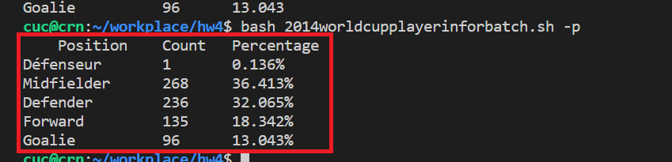

# Linux第四章实验--shell脚本编程基础

-------------------------------------

## 软件坏境  

- **VirtualBox 6.1**

- **Ubuntu 20.04** 
 
- **Visual Studio Code** 

 - **Travis CI**

------------------------

## 实验问题

 ### 任务一：用bash编写一个图片批处理脚本，实现以下功能：
- ☑️支持命令行参数方式使用不同功能
- ☑️支持对指定目录下所有支持格式的图片文件进行批处理
- ☑️支持以下常见图片批处理功能的单独使用或组合使用
    - ☑️支持对jpeg格式图片进行图片质量压缩
    - ☑️支持对jpeg/png/svg格式图片在保持原始宽高比的前提下压缩分辨率
    - ☑️支持对图片批量添加自定义文本水印
    - ☑️支持批量重命名（统一添加文件名前缀或后缀，不影响原始文件扩展名）
    - ☑️支持将png/svg图片统一转换为jpg格式图片


 ### 任务二：用bash编写一个文本批处理脚本，对以下附件分别进行批量处理完成相应的数据统计任务：
- 2014世界杯运动员数据
    - ☑️统计不同年龄区间范围（20岁以下、[20-30]、30岁以上）的球员数量、百分比
    - ☑️统计不同场上位置的球员数量、百分比
    - ☑️名字最长的球员是谁？名字最短的球员是谁？
    - ☑️年龄最大的球员是谁？年龄最小的球员是谁？
- Web服务器访问日志
    - ☑️统计访问来源主机TOP 100和分别对应出现的总次数
    - ☑️统计访问来源主机TOP 100 IP和分别对应出现的总次数
    - ☑️统计最频繁被访问的URL TOP 100
    - ☑️统计不同响应状态码的出现次数和对应百分比
    - ☑️分别统计不同4XX状态码对应的TOP 10 URL和对应出现的总次数
    - ☑️给定URL输出TOP 100访问来源主机

## 实验报告要求
- **继承第一章：[Linux基础（实验）](https://c4pr1c3.github.io/LinuxSysAdmin/chap0x01.exp.md.html#/title-slide)的所有实验报告要求**
- **上述任务的所有源代码文件必须单独提交并提供详细的–help脚本内置帮助信息**
- **任务二的所有统计数据结果要求写入独立实验报告**


  -----------------------------------


## 实验步骤

### 任务一：用bash编写一个图片批处理脚本


**1.安装`shellcheck`和`imagemagick`**
```shell
$ sudo apt-get update
$ sudo apt-get install -y shellcheck
$ sudo apt-get insatll -y imagemagick
```


**2.将测试图片导入远程Linux虚拟机内，并查看**


**3.编写[[任务一]](shellScript/imagebatch.sh)的脚本代码**


**4.运行测试结果**
- 先进行shellcheck，没有问题之后就查看`–h`脚本内置帮助信息
```shell
$ shellcheck imagebatch.sh
$ bash imagebatch.sh -h
```


- 支持对jpeg格式图片进行图片质量压缩
```shell
$ identify water.jpeg
$ bash imagebatch.sh -q 50
```


- 支持对jpeg/png/svg格式图片在保持原始宽高比的前提下压缩分辨率
```shell
$ bash imagebatch.sh -r 90
```


- 支持对图片批量添加自定义文本水印
```shell
$ bash imagebatch.sh -w 5 crn
```


- 支持批量重命名（统一添加文件名前缀，不影响原始文件扩展名）
```shell
$ bash imagebatch.sh -p CRN
```


报错的原因真的很细节，就是因为我在这两个变量之间**多打了一个空格**，就出现了错误，所以一定要细心！
</br>

- 支持批量重命名（统一添加文件名后缀，不影响原始文件扩展名）
```shell
$ bash imagebatch.sh -s CUC
```


- 支持将png/svg图片统一转换为jpg格式图片
```shell
$ bash imagebatch.sh -t
```


</br>

### 任务二：用bash编写一个文本批处理脚本，对以下附件分别进行批量处理完成相应的数据统计任务

###### 2014世界杯运动员数据

**1.将`worldcupplayerinfo.tsv`文件导入远程虚拟机中，可以直接拖拽到vscode-remote里，也可以输入下列代码**
```shell
$ wget "https://c4pr1c3.gitee.io/linuxsysadmin/exp/chap0x04/worldcupplayerinfo.tsv"
```


**2.编写[[task2.1]](shellScript/2014worldcupplayerinforbatch.sh)的脚本代码**


**3.运行测试[task2.1结果](task2.1_result.md)**
- 先进行shellcheck，没有问题之后就查看`–h`脚本内置帮助信息
```shell
$ shellcheck 2014worldcupplayerinforbatch.sh
$ bash 2014worldcupplayerinforbatch.sh -h
```


- 统计不同年龄区间范围（20岁以下、[20-30]、30岁以上）的球员数量、百分比
```shell
$ bash 2014worldcupplayerinforbatch.sh -a
```


- 统计不同场上位置的球员数量、百分比
```shell
$ bash 2014worldcupplayerinforbatch.sh -p
```



- 查找名字最长的球员
```shell
$ bash 2014worldcupplayerinforbatch.sh -l
```


- 查找名字最短的球员
```shell
$ bash 2014worldcupplayerinforbatch.sh -s
```


- 查找年龄最大的球员
```shell
$ bash 2014worldcupplayerinforbatch.sh -o
```


- 查找年龄最小的球员
```shell
$ bash 2014worldcupplayerinforbatch.sh -y
```


###### Web服务器访问日志

**1.将`web_log.tsv.7z`文件导入远程虚拟机中，可以直接拖拽到vscode-remote里，并且解压，也可以输入下列代码**
```shell
$ wget "https://c4pr1c3.github.io/LinuxSysAdmin/exp/chap0x04/web_log.tsv.7z"
$ 7z x web_log.tsv.7z # 解压
```


**2.编写[[task2.2]](shellScript/web_logbatch.sh)的脚本代码**


**3.运行测试[task2.2结果](task2.2_result.md)**
- 先进行shellcheck，没有问题之后就查看`–h`脚本内置帮助信息
```shell
$ shellcheck web_logbatch.sh
$ bash web_logbatch.sh -h
```


- 统计访问来源主机TOP 100和分别对应出现的总次数
```shell
$ bash web_logbatch.sh -t
```


- 统计访问来源主机TOP 100 IP和分别对应出现的总次数
```shell
$ bash web_logbatch.sh -i
```


- 统计最频繁被访问的URL TOP 100
```shell
$ bash web_logbatch.sh -u
```


- 统计不同响应状态码的出现次数和对应百分比
```shell
$ bash web_logbatch.sh -c
```


- 分别统计不同4XX状态码对应的TOP 10 URL和对应出现的总次数
```shell
$ bash web_logbatch.sh -f
```


- 给定URL输出TOP 100访问来源主机
```shell
$ bash web_logbatch.sh -s /software/winvn/winvn.html/bluemarb.gif
```


**可通过[我的Travis CI](https://app.travis-ci.com/github/CUCCS/2022-linux-public-Cynthia-Crn)来查看上述代码的执行情况**


--------------------------------------------


## 问题及解决办法

- **在task1中，对jpeg/png/svg格式图片在保持原始宽高比的前提下压缩分辨率时出现报错。查看报错信息发现好像是svg图片的问题，但是不知道如何处理，难道是因为svg图片不支持压缩吗？**

报错信息：
    ```shell
    identify-im6.q16: Unescaped '<' not allowed in attributes values
    `No such file or directory` @ error/svg.c/SVGError/2998.
    identify-im6.q16: attributes construct error
    `No such file or directory` @ error/svg.c/SVGError/2998.
    identify-im6.q16: error parsing attribute name
    `No such file or directory` @ error/svg.c/SVGError/2998.
    identify-im6.q16: attributes construct error
    `No such file or directory` @ error/svg.c/SVGError/2998.
    identify-im6.q16: xmlParseStartTag: problem parsing attributes
    `No such file or directory` @ error/svg.c/SVGError/2998.
    identify-im6.q16: Couldn't find end of Start Tag g
    `No such file or directory` @ error/svg.c/SVGError/2998.
    ```
其函数：
```bash
    # 对jpeg/png/svg格式图片在保持原始宽高比的前提下压缩成R分辨率
    # convert filename1 -resize 50% filename2
    function CompressionResolution(){
        R=$1
        for i in *;do
            type=${i##*.} # 获取文件类型 （删除最后一个.及左边的全部字符）
            if [[ ${type} != "jpeg" && ${type} != "png" && ${type} != "svg" ]]; then continue; fi;
            convert "${i}" -resize "${R}" "${i}"
            echo "${i} is resized."
        done

        echo "=====Picture resolution compression is completed.====="
    }
```

执行代码：
    ```shell
    $ bash imagebatch.sh -r 90
    ```
    
</br>

- **关于Travis CI的部署和运行，我不清楚要怎么操作**
查阅同学发的帖子以及问过同学之后，我知道了是把需要运行的脚本文件和编写好的`.travis.yml`一起push到作业仓库上去，他才会开始运行。


---------------------------------

## 参考链接

- [linux下ImageMagick安装和使用](https://www.cnblogs.com/beyang/p/7597819.html)

- [ImageMagick 图像操作](https://www.w3cschool.cn/imagemagick_use/imagemagick_use-nvfu281r.html)

- [awk教程](https://www.cnblogs.com/heidsoft/p/7698022.html)

- [awk 处理多行数据](https://blog.csdn.net/kehyuanyu/article/details/20916169)

- [linux命令--查找与统计（grep、awk、sort、uniq、wc）](https://blog.csdn.net/hshuihui/article/details/77915398)

- [CUCCS\2021-linux-public-Lychee00](https://github.com/CUCCS/2021-linux-public-Lychee00/tree/59f2315af612524250237beb3769434244a9cddd/chap0x04)

- [【经验贴】在作业仓库部署Travis CI的一些遇到的坑](http://courses.cuc.edu.cn/course/82669/learning-activity/full-screen#/248353/topics/254371?show_sidebar=false&scrollTo=topic-272053&topicIds=273031,272053,268090,266605,266095,266092,264739,263203,254371,251941&pageIndex=1&pageCount=1&predicate=lastUpdatedDate&reverse)
