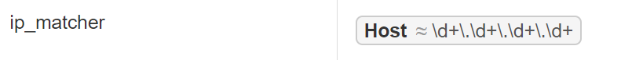
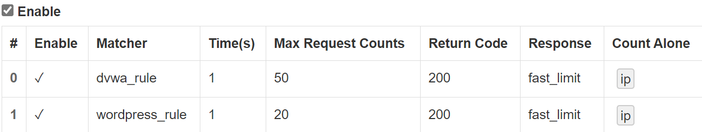

# Linux第五章实验--Web服务器

-------------------------------------

## 软件坏境  

- **VirtualBox 6.1**

- **Ubuntu 20.04** 
 
- **Visual Studio Code** 

 - **[Nginx](http://nginx.org/)**

 - **[VeryNginx](https://github.com/alexazhou/VeryNginx)**

 - **[WordCompress 4.7](https://wordpress.org/)**

 - **[Damn Vulnerable Web Application(DVWA)](https://dvwa.co.uk/)**

------------------------

## 实验问题

### 基本要求
 - 在一台主机（虚拟机）上同时配置[Nginx](http://nginx.org/)和[VeryNginx](https://github.com/alexazhou/VeryNginx)
  - VeryNginx作为本次实验的Web App的反向代理服务器和WAF
  - PHP-FPM进程的反向代理配置在nginx服务器上，VeryNginx服务器不直接配置Web站点服务
- 使用[WordCompress 4.7](https://wordpress.org/)搭建的站点对外提供访问的地址为： http://wp.sec.cuc.edu.cn
- 使用[Damn Vulnerable Web Application(DVWA)](https://dvwa.co.uk/)搭建的站点对外提供访问的地址为： http://dvwa.sec.cuc.edu.cn
 

### 安全加固要求
- 使用IP地址方式均无法访问上述任意站点，并向访客展示自定义的友好错误提示信息页面-1
- [Damn Vulnerable Web Application(DVWA)](https://dvwa.co.uk/)只允许白名单上的访客来源IP，其他来源的IP访问均向访客展示自定义的友好错误提示信息页面-2
- 在不升级Wordpress版本的情况下，通过定制[VeryNginx](https://github.com/alexazhou/VeryNginx)的访问控制策略规则，**热**修复[WordPress < 4.7.1 - Username Enumeration](https://www.exploit-db.com/exploits/41497/)
- 通过配置[VeryNginx](https://github.com/alexazhou/VeryNginx)的Filter规则实现对[Damn Vulnerable Web Application(DVWA)](https://dvwa.co.uk/)的SQL注入实验在低安全等级条件下进行防护

### VeryNginx配置要求
- [VeryNginx](https://github.com/alexazhou/VeryNginx)的Web管理页面仅允许白名单上的访客来源IP，其他来源的IP访问均向访客展示自定义的**友好错误提示信息页面-3**
- 通过定制[VeryNginx](https://github.com/alexazhou/VeryNginx)的访问控制策略规则实现：
  - 限制DVWA站点的单IP访问速率为每秒请求数 < 50
  - 限制Wordpress站点的单IP访问速率为每秒请求数 < 20
  - 超过访问频率限制的请求直接返回自定义**错误提示信息页面-4**
  - 禁止curl访问


  -----------------------------------


## 实验步骤

### 一、安装软件环境

**更改Windows主机hosts文件**
```shell
# nginx
192.168.56.101 vn.sec.cuc.edu.cn
192.168.56.101 dvwa.sec.cuc.edu.cn
192.168.56.101 wp.sec.cuc.edu.cn
```


**配置php及相关组件**
```shell
$ sudo apt install php-fpm php-mysql php-curl php-gd php-intl php-mbstring php-soap php-xml php-xmlrpc php-zip
```


**安装与配置MySQL**
```shell
# 更新软件包
$ sudo apt-get update
# 下载MySQL
$ sudo apt-get install mysql-server
# 安装完成后可直接进入MySQL登录
$ sudo mysql
# 设置MySQL的root初始密码
$ ALTER USER 'root'@'localhost' IDENTIFIED WITH mysql_native_password BY 'your_password';
# 运行MySQL的安全配置向导
$ sudo mysql_secure_installation
# 检查MySQL服务的状态
$ sudo systemctl status mysql
```

安装相关的库和依赖
```shell
# 安装编译工具gcc
$ sudo apt install gcc
# pcre
sudo apt-get install libpcre3 libpcre3-dev
# make
sudo apt install make
# zlib
sudo apt-get install zlib1g-dev
# penssl library
sudo apt install libssl-dev
```

**1.安装Nginx**
```shell

# 安装
$ sudo apt update
$ sudo apt install nginx

# 检查哪些 UFW 配置文件可用
$ sudo ufw app list

# 在 port 上允许常规 HTTP 流量80
$ sudo ufw allow 'Nginx HTTP'

# 验证更改
$ sudo ufw status
```
- 在主机访问80端口发现可以访问Nginx初始页面。
<br/>
*心得：刚开始一直打开的都是apache2的页面，试过停止apache2服务，但是无济于事，最后简单粗暴地把apache2卸载之后终于成功打开了Nginx初始页面*

**2.安装VeryNginx**
- 克隆 VeryNginx 仓库到本地, 然后进入仓库目录，执行以下命令
```shell
 # 克隆VeryNginx仓库
$ git clone https://github.com/alexazhou/VeryNginx.git
$ cd VeryNginx
# python3
$ sudo python3 install.py install
```

- 修改`/opt/verynginx/openresty/nginx/conf/nginx.conf`配置文件
```shell 
# 将user从nginx修改为www-data
# 修改server监听端口为8081
# 保存退出

$ sudo vim /opt/verynginx/openresty/nginx/conf/nginx.conf

#修改以下部分：

# 用户名
user  www-data;

# 监听端口
# 为了不和其他端口冲突，此处设置为8081
server {
        listen 192.168.56.101:8081;
        
        #this line shoud be include in every server block
        include /opt/verynginx/verynginx/nginx_conf/in_server_block.conf;

        location = / {
            root   html;
            index  index.html index.htm;
        }
    }
```

- 添加进程的权限
```shell 
$ chmod -R 777 /opt/verynginx/verynginx/configs
```
- 在主机访问8081端口。


- 启动verynginx，通过浏览器对verynginx进行配置，在浏览器中访问`http://vn.sec.cuc.edu.cn:8081/verynginx/index.html` 默认用户名和密码是 `verynginx` / `verynginx`。登录后就可以进行相关配置。
```shell
$ cd /opt/verynginx/openresty/nginx/sbin
$ ./nginx
```


**3.安装WordPress**

- 安装与配置
```shell
# 下载安装包
$ sudo wget https://wordpress.org/wordpress-4.7.zip

# 解压
$ sudo apt install p7zip-full
$ sudo 7z x wordpress-4.7.zip

# 将解压后的wordpress移至指定路径
$ sudo mkdir /var/www/html/wp.sec.cuc.edu.cn
$ sudo cp -r wordpress /var/www/html/wp.sec.cuc.edu.cn
```

- 在MySQL中新建一个数据库用于wordpress
```shell
#登录数据库
$ sudo mysql 
# 新建一个数据库wordpress
> CREATE DATABASE wordpress DEFAULT CHARACTER SET utf8 COLLATE utf8_unicode_ci;
# 新建一个用户 
> create user 'wordpressuser'@'localhost' IDENTIFIED BY 'password';
# 授权
> grant all on wordpress.* to 'wordpressuser'@'localhost';
# 刷新并退出
> FLUSH PRIVILEGES;
> EXIT;
```
- 重启php-fpm
```shell
$ sudo systemctl restart php7.4-fpm
```

- 配置nginx
```shell
# 进入nginx目录
$ sudo vim /etc/nginx/sites-enabled/default
# 将网站根站点修改为wordpress的安装目录 并保存退出
root /var/www/html/wp.sec.cuc.edu.cn;
# 将WordPress网站目录所属用户组设定至Nginx指定的用户（由/etc/nginx/nginx.conf配置中的user www-data;指定）
$ sudo chown -R www-data /var/www/html/wp.sec.cuc.edu.cn;
$ sudo chgrp -R www-data /var/www/html/wp.sec.cuc.edu.cn;
```

- 使用`wp.sec.cuc.edu.cn/wordpress/wp-admin/`访问wordpress进行配置，选择语言，然后连接数据库，设置完wordpress用户名密码即可访问wordpress网站。
```shell
# 用户名  crn
# 密码    crn***
```


- 配置PHP-FPM进程的反向代理
  - 配置Nginx服务器块文件
  ```shell
  $ sudo vim /etc/nginx/sites-available/wp.sec.cuc.edu.cn
  ```
  - 写入：
  ```shell
  server {
    listen 80 default_server;
    listen [::]:80 default_server;

    root /var/www/html/wp.sec.cuc.edu.cn;
    index index.php index.html index.htm index.nginx-debian.html;
    server_name wp.sec.cuc.edu.cn;

    location / {
        # try_files $uri $uri/ =404;
        try_files $uri $uri/ /index.php$is_args$args;

    }

    # 配置PHP-FPM进程的反向代理配置在nginx服务器上    
    location ~ \.php$ {
        include snippets/fastcgi-php.conf;
        fastcgi_pass unix:/var/run/php/php7.4-fpm.sock;
    }

    location ~ /\.ht {
        deny all;
    }
  }
  ```

  - 创建从新服务器块配置文件到`/etc/nginx/sites-enabled/`目录的符号链接
  ```shell
  $ sudo ln -s /etc/nginx/sites-available/wp.sec.cuc.edu.cn /etc/nginx/sites-enabled/
  ```

  - 取消链接默认配置文件
  ```shell
  $ sudo unlink /etc/nginx/sites-enabled/default
  ```
  - 测试并重启nginx
  ```shell
  $ sudo nginx -t
  $ sudo systemctl reload nginx
  ```

**4.安装DVWA**

- 下载安装
```shell
#将DVWA源码clone到可写目录
$ sudo git clone https://github.com/ethicalhack3r/DVWA /tmp/DVWA
#拷贝至/var/www/html
$ sudo mkdir /var/www/html/dvwa.sec.cuc.edu.cn
$ sudo cp -r /tmp/DVWA/. /var/www/html/dvwa.sec.cuc.edu.cn
```
- 创建数据库和供DVWA使用的用户
```shell
#登录MySQL
$ sudo mysql

#为dvwa创建MySQL数据库
> CREATE DATABASE dvwa DEFAULT CHARACTER SET utf8 COLLATE utf8_unicode_ci;
> CREATE USER 'dvwauser'@'localhost' IDENTIFIED BY 'p@ssw0rd';
> GRANT ALL ON dvwa.* TO 'dvwauser'@'localhost';
> FLUSH PRIVILEGES;
> exit;
```
- 设置DVWA与PHP等相关环境
```shell
# 重命名
$ cd /var/www/html/dvwa.sec.cuc.edu.cn/config/
$ sudo mv config.inc.php.dist config.inc.php

# 修改配置
$ sudo vim /var/www/html/dvwa.sec.cuc.edu.cn/config/config.inc.php
## 根据数据库对应修改配置
$_DVWA[ 'db_database' ] = 'dvwa';
$_DVWA[ 'db_user' ]     = 'dvwauser';
$_DVWA[ 'db_password' ] = 'p@ssw0rd';
##

# 修改php配置
$ sudo vim /etc/php/7.4/fpm/php.ini 

## 设置以下内容
allow_url_include = on
allow_url_fopen = on
safe_mode = off
display_errors = off
##

#重启php
$ sudo systemctl restart php7.4-fpm
#授权给www-data用户和组
$ sudo chown -R www-data.www-data /var/www/html/dvwa.sec.cuc.edu.cn
```
- 创建新服务器块配置文件
```shell
$ sudo vim /etc/nginx/sites-available/dvwa.sec.cuc.edu.cn
```
- 写入：
```shell
server {
    listen 8080 default_server;
    listen [::]:8080 default_server;

    root /var/www/html/dvwa.sec.cuc.edu.cn;
    index index.php index.html index.htm index.nginx-debian.html;
    server_name dvwa.sec.cuc.edu.cn;

    location / {
        #try_files $uri $uri/ =404;
        try_files $uri $uri/ /index.php$is_args$args;  
    }

    location ~ \.php$ {
        include snippets/fastcgi-php.conf;
        fastcgi_pass unix:/var/run/php/php7.4-fpm.sock;
    }

    location ~ /\.ht {
        deny all;
    }
  }
```

- 创建从新服务器块配置文件到`/etc/nginx/sites-enabled/`目录的符号链接
```shell
$ sudo ln -s /etc/nginx/sites-available/dvwa.sec.cuc.edu.cn /etc/nginx/sites-enabled/
```
- 测试并重启Nginx服务
```shell
$ sudo nginx -t
$ sudo systemctl reload nginx
```

- 通过8080端口访问`dvwa.sec.cuc.edu.cn`，生成需要使用的数据库
在登录页面输入默认账号密码：
```shell
User: admin
Password: password
```


### 实验过程

#### 基本要求
**使用VeryNginx反向代理Wordpress,DVWA**

- 配置`wp.sec.cuc.edu.cn`和`dvwa.sec.cuc.edu.cn`
  - 添加Matcher
    <br/>
  

 - 添加Up Stream节点以及添加代理通行证
 <br/>
 

#### 安全加固要求

1.使用IP地址方式均无法访问上述任意站点，并向访客展示自定义的**友好错误提示信息页面-1**

- 添加Matcher<br/>

- 添加Response

- 添加Filter

- 在网页输入IP地址`192.168.56.101`,结果：


2.Damn Vulnerable Web Application (DVWA)只允许白名单上的访客来源IP，其他来源的IP访问均向访客展示自定义的**友好错误提示信息页面-2**

- 添加Matcher<br/>

- 添加Response

- 添加Filter

- 在网页输入自己的IP地址`192.168.56.101`,结果：


3.在不升级Wordpress版本的情况下，通过定制VeryNginx的访问控制策略规则，热修复WordPress < 4.7.1 - Username Enumeration
- bug

- 添加Matcher

- 添加Filter

- 在网页输入自己的IP地址`192.168.56.101`,结果：


4.通过配置VeryNginx的Filter规则实现对Damn Vulnerable Web Application (DVWA)的SQL注入实验在低安全等级条件下进行防护
- 添加Matcher<br/>

- 添加Filter<br/>

- 结果：


#### VeryNginx配置要求

1.VeryNginx的Web管理页面仅允许白名单上的访客来源IP，其他来源的IP访问均向访客展示自定义的**友好错误提示信息页面-3**
- 添加Matcher<br/>

- 添加Response

- 添加Filter

- 结果：


6.通过定制VeryNginx的访问控制策略规则实现：

 - 限制DVWA站点的单IP访问速率为每秒请求数 < 50

 - 限制Wordpress站点的单IP访问速率为每秒请求数 < 20
   - 添加频率限制Frequency Limit
   

 - 超过访问频率限制的请求直接返回**自定义错误提示信息页面-4**
   - 添加自定义Response
   
   - 结果：
   

  - 禁止curl访问
    - 添加Matcher<br/>
    
    - 添加Filter<br/>
    
    - 结果：
     


-------------------------------------------------

## 实验中遇到的问题
- 由于看视频没有仔细，老师是在虚拟机上修改hosts文件的，但是有说是在宿主机上修改，所以导致我在修改hosts文件时是在虚拟机上修改的，导致实验一直出问题，后来再看老师视频的时候才发现是**更改Windows主机hosts文件**
```shell
# nginx
192.168.56.101 vn.sec.cuc.edu.cn
192.168.56.101 dvwa.sec.cuc.edu.cn
192.168.56.101 wp.sec.cuc.edu.cn
```
- 在安装Nginx时，一直打不开Nginx的初始欢迎页面，打开的都是`下面这个页面`，各方查证，发现是apache2占有了80端口，而且没办法停止运行也kill不掉，最后就直接把apache2直接卸载了，最后终于成功了。

```shell
# 卸载apache2
$ sudo apt-get --purge remove apache2
$ sudo apt-get --purge remove apache2.2-common
$ sudo apt-get autoremove
$ sudo find  /etc -name "*apache*" -exec  rm -rf {} \;
$ sudo rm -rf /var/www
```

- 配置nginx访问wordpress，遇到访问首页报错
```
directory index of "/var/www/wordpress/" is forbidden
```
因为nginx本身有index指令，而默认的index里是不包含`index.php`
```
index index.html index.htm index.nginx-debian.html;
```
但是wordpress的入口是`index.php`,所以直接不加任何path访问域名，会因为找不到匹配的index而报错，此时只需要把wordpress的入口加入到index指令后，然后重载nginx即可。
```
index index.php;
```
---------------------------------

## 参考链接

- [How To Install Linux, Nginx, MySQL, PHP (LEMP stack) on Ubuntu 20.04](https://www.digitalocean.com/community/tutorials/how-to-install-linux-nginx-mysql-php-lemp-stack-on-ubuntu-20-04)

- [linux怎样修改hosts文件](https://m.php.cn/article/486887.html)

- [Ubuntu Server 20.04 安装nginx](https://blog.csdn.net/LZW15082682930/article/details/113760419)

- [Nginx重启失败 Active: failed (Result: exit-code)](https://blog.csdn.net/z_xuewen/article/details/103859099)

- [2021-linux-public-Lychee00](https://github.com/CUCCS/2021-linux-public-Lychee00/blob/9c1301b19435e44352ef4e605b9bdd169620c26a/chap0x05/exp0x05.md)

- [安装与配置MySQL](https://blog.csdn.net/qq_40039731/article/details/124675476)

- [Linux下安装、配置、启动并访问Nginx（在线安装）](https://www.cnblogs.com/pengsay/p/15551139.html)

- [记一个nginx错误directory index of “/var/www/xxxx/“ is forbidden,](https://blog.csdn.net/qq_27868061/article/details/120720480)